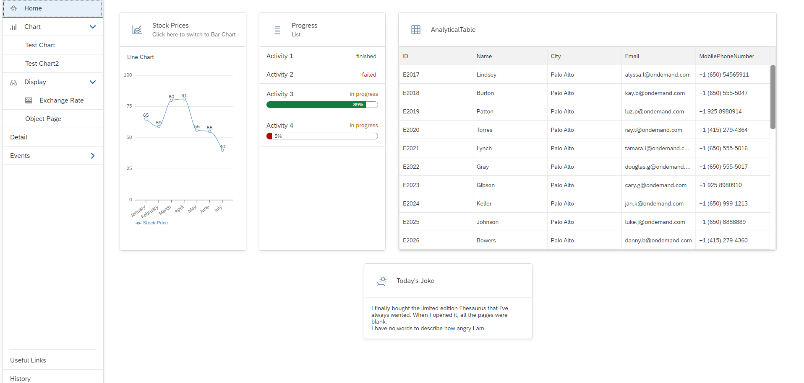
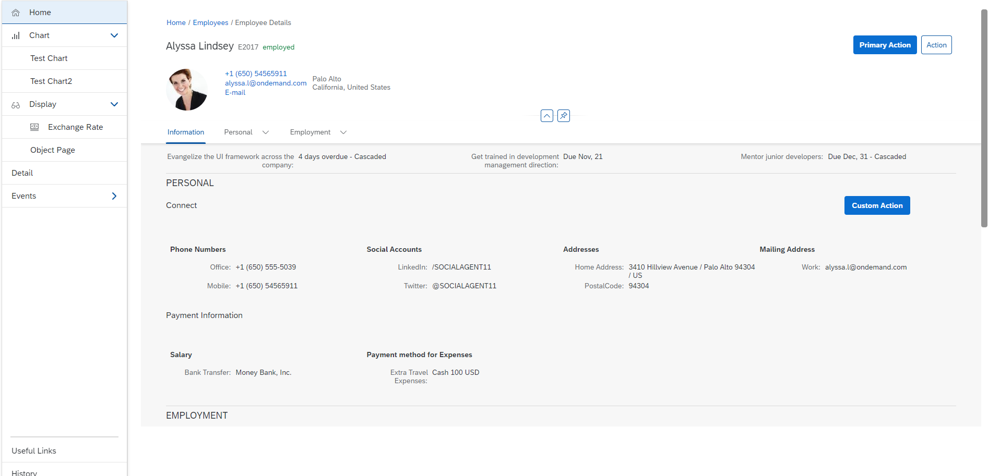
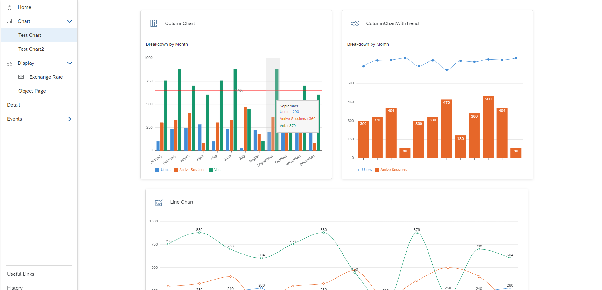
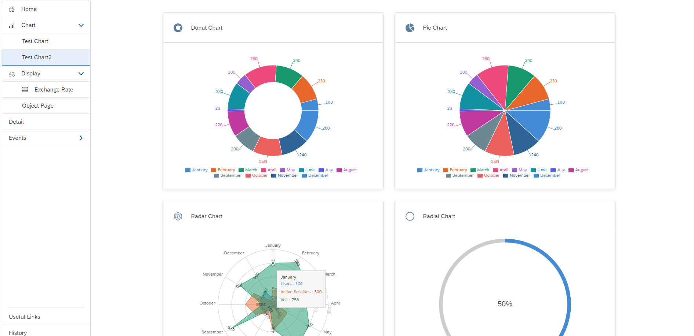
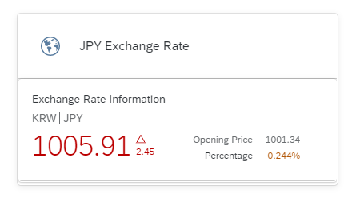
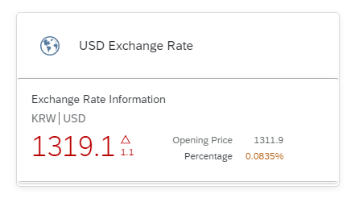

# React UI5

This is a practice project using ui5 components in React.

We implemented various types of charts, exchange rate tables, and tables using external APIs.

---

[Project URL](https://mesh-kr.cfapps.ap12.hana.ondemand.com/)

`Home.jsx`

`UserInfo.jsx`

`Chart.jsx`

`Chart2.jsx`

`ExRate.jsx`

